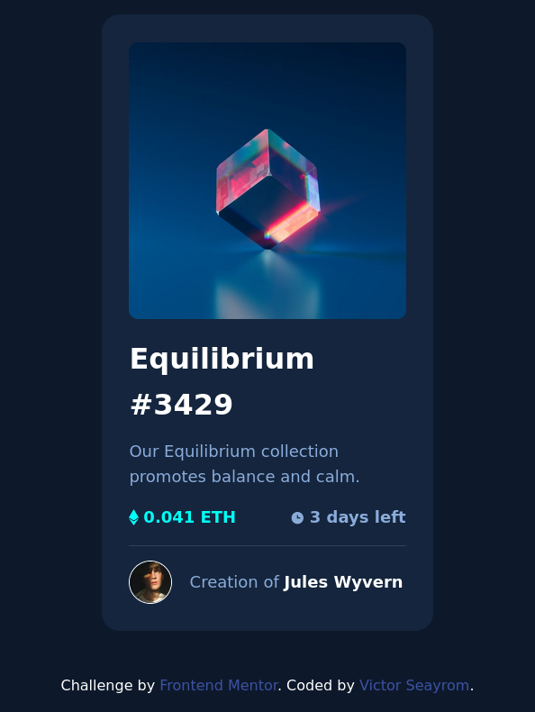

# Frontend Mentor - NFT preview card component solution

This is a solution to the [NFT preview card component challenge on Frontend Mentor](https://www.frontendmentor.io/challenges/nft-preview-card-component-SbdUL_w0U). Frontend Mentor challenges help you improve your coding skills by building realistic projects. 

## Table of contents

- [Overview](#overview)
  - [The challenge](#the-challenge)
  - [Screenshot](#screenshot)
  - [Links](#links)
- [My process](#my-process)
  - [Built with](#built-with)
  - [What I learned](#what-i-learned)
  - [Continued development](#continued-development)
  - [Useful resources](#useful-resources)
- [Author](#author)
- [Acknowledgments](#acknowledgments)

## Overview

### The challenge

Users should be able to:

- View the optimal layout depending on their device's screen size
- See hover states for interactive elements

### Screenshot

### Links

- Solution URL: [github](https://github.com/seayrom/nft-preview-card-component)
- Live Site URL: [github-pages](https://seayrom.github.io/nft-preview-card-component/)

### Built with

- Semantic HTML5 markup
- CSS custom properties
- Flexbox

### What I learned

Using positioning to get the desired layout. That is something I know but was a bit challenging to implement.

### Continued development

I want to continue practicing, challenging myself and solving the problems that come along.

### Useful resources

- [w3schools](https://www.w3schools.com/howto/tryit.asp?filename=tryhow_css_image_overlay_opacity) - This helped me to implement the positioning property and also use the opaque property. I really liked this pattern and will use it going forward.

## Author

- Website - [seayrom](https://github.com/seayrom)
- Frontend Mentor - [@seayrom](https://www.frontendmentor.io/profile/seayrom)

